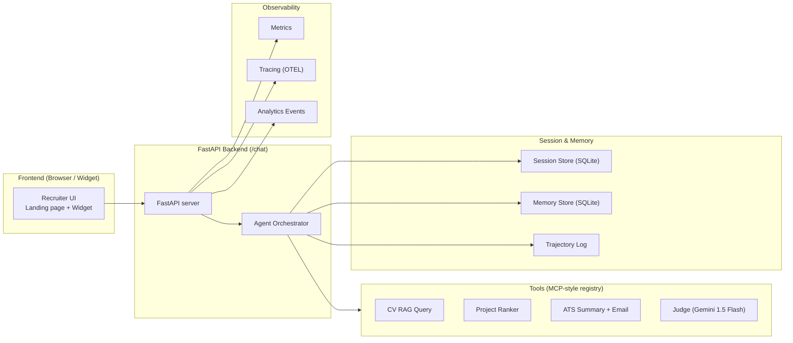
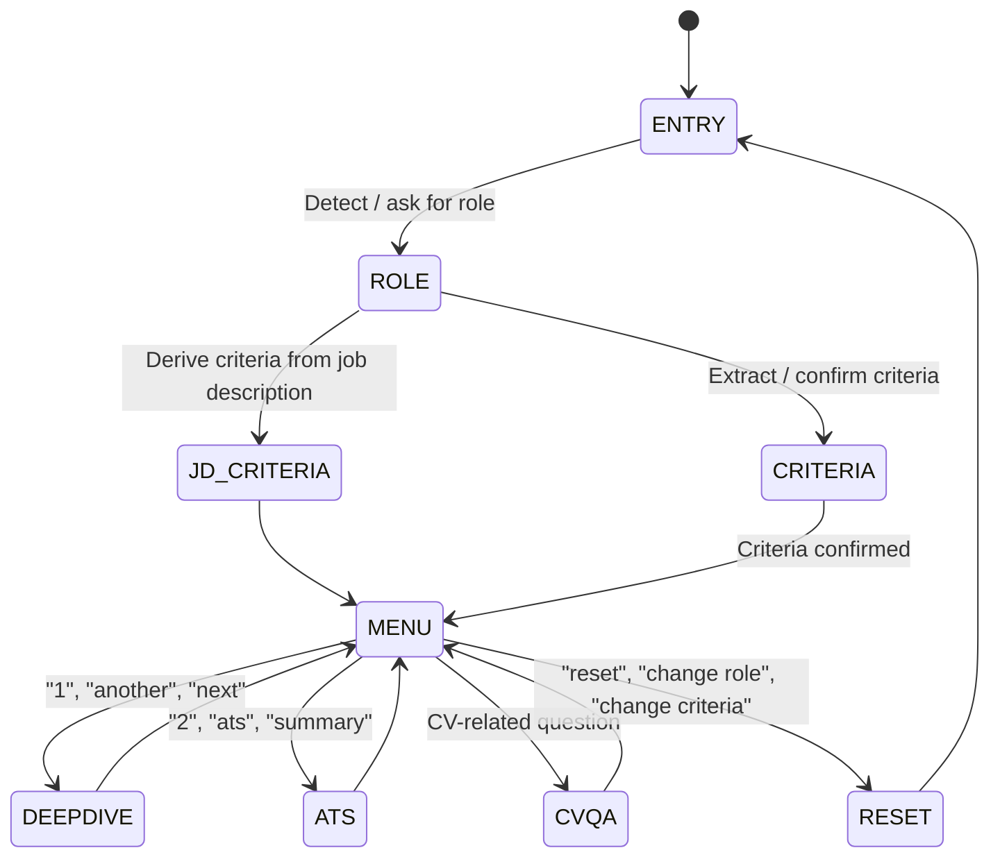

# Sergiu – AI Recruiter Tour Agent

A **production-ready AI recruiting agent** built using **Google/Kaggle Agent Architecture** principles.

This project demonstrates a clean, maintainable, end-to-end implementation of:
- Deterministic agent orchestration
- Schema-driven tools
- RAG + embeddings
- Memory & session management
- LLM-as-a-judge evaluation
- Observability & analytics
- Deployment to Cloud Run

The agent acts as an **interactive recruiter companion**, helping hiring managers instantly understand your strongest qualifications through:
- Smart role detection
- Criteria-based project selection
- Guided project deep dives
- CV-RAG question answering
- ATS-ready summary generation
- Recruiter email drafting
- Session memory + trajectory logging
- Automatic onboarding flows from GitHub/LinkedIn

The recommended pipeline follows:
**Frontend → FastAPI Backend → Agent Orchestrator → Tools → State + Trajectory**

---

## 🧠 Core Capabilities

### ✔ Recruiter-Aware Entry
When a visitor arrives from GitHub/LinkedIn, the agent enters a dedicated onboarding flow:
> "Welcome! What role are you hiring for?"

### ✔ Role & Criteria Extraction
Understands and canonicalizes roles:
- Senior ML Engineer
- AI Engineer
- NLP Researcher
- Data Scientist

And recruiter criteria:
- Production RAG
- Ownership
- Leadership
- Communication
- Safety / reliability focus

### ✔ Project Relevance Ranking
Uses embeddings to shortlist the most relevant projects based on:
- Role
- Criteria
- Tags
- Description
- Impact statements

### ✔ Guided Deep-Dive Flow
For each project, the agent explains:
- What it does
- Its impact
- Why it fits the role
- How it satisfies recruiter criteria

### ✔ ATS Summary & Recruiter Email
Generates:
- A polished ATS-ready profile
- A ready-to-paste follow-up email

### ✔ CV-RAG (Gemini Embeddings)
- Uses **text-embedding-004** to embed CV chunks
- Retrieves relevant sections
- Uses **Gemini 1.5 Flash** for grounded responses
- Hybrid regex extractors for guaranteed answers (e.g., location, certifications)

### ✔ Quality & Observability
Includes:
- Trajectory logging (user → agent → tools)
- LLM Judge evaluation (1–5 scoring)
- Metrics: latency & request count
- OpenTelemetry tracing
- Structured logs

---

## 🏗️ System Architecture

### High-Level Architecture


---

## 🔁 Agent Flow (State Machine)


---

## 🛠 Project Structure

```text
recruiter-agent/
├── README.md
├── requirements.txt
├── main.py
├── app/
│   ├── __init__.py
│   ├── server.py
│   ├── agent.py
│   ├── tools.py
│   ├── cv_rag.py
│   ├── quality.py
│   ├── mcp.py
│   ├── github_portfolio.py
│   ├── extractor.py
│   ├── store.py
│   ├── session_store.py
│   ├── models/
│   │   ├── state.py
│   │   ├── chat.py
│   │   └── __init__.py
│   ├── telemetry/
│   │   ├── logging.py
│   │   ├── tracing.py
│   │   └── __init__.py
│   └── analytics.py
└── frontend/
    └── index.html
```

---

## 🚀 Deployment (Google Cloud Run)

Ensure `GOOGLE_API_KEY` is set in Cloud Run → Variables.

```bash
gcloud run deploy recruiter-agent \
  --source . \
  --platform managed \
  --allow-unauthenticated \
  --region europe-west1 \
  --set-env-vars "GOOGLE_API_KEY=$GOOGLE_API_KEY"
```

Or use the included `deploy.ps1`.

---

## 🌟 Why This Project Stands Out

- Fully aligned with Google’s modern agent architecture  
- Implements every course feature: tools, RAG, memory, evaluation  
- Production-ready, observable, testable  
- Includes **LLM-as-a-Judge**, a standout feature  
- Clean, maintainable architecture  
- Designed as a real product, not a demo  
